# 👋 Hi, I'm Gabriel Veloso

🎓 I'm an 18-year-old **Systems Analysis and Development** student at the Federal Institute of Catanduva (IFSP).  
💻 Passionate about technology, problem-solving, and building efficient software solutions.  
🌱 Currently expanding my knowledge in software development and always seeking new challenges.  

---

## 🛠️ Tech Stack
Here are some of the technologies I work with:

---

## 📊 GitHub Stats

---

## 📫 Let's Connect
- 💼 [LinkedIn](https://www.linkedin.com/in/gabrielvfdelima/)  
- 📧 [Email](mailto:gabrielvfdelima@gmail.com)  

---
✨ *"Always learning, always building."*
